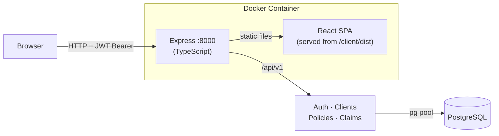

# Insurance Portal

A full-stack insurance management system for managing clients, policies, and claims.

## Architecture



## Tech Stack

| Layer | Technology |
|---|---|
| Frontend | React 19, Vite 8, TypeScript, TanStack Query v5, Zustand, shadcn/ui, Tailwind CSS v4 |
| Backend | Node.js, Express 4, TypeScript, tsx runtime |
| Auth | JWT (access 15 min + httpOnly refresh cookie 7 d), bcrypt (cost 12) |
| Database | PostgreSQL, `pg` connection pool (max 20) |
| Validation | Zod v4 — shared schemas drive both API validation and TypeScript types |
| Testing | Vitest, Supertest |
| CI | GitHub Actions (typecheck + test + lint + build on every push) |
| Deployment | Docker multi-stage build — single container serves API and React client |

## Project Structure

```
insurance-portal/
├── client/                      # React frontend (Vite)
│   └── src/
│       ├── api/                 # TanStack Query hooks (auth, clients, policies, claims)
│       ├── features/            # Page components per domain
│       ├── components/          # Shared UI (Layout, ConfirmDialog, LoadingSpinner)
│       └── lib/                 # axios instance, Zustand auth store, queryClient
├── server/                      # Express API (TypeScript)
│   ├── api/v1/
│   │   ├── controllers/         # Route handlers
│   │   ├── Services/            # Business logic
│   │   ├── db/                  # SQL queries via pg
│   │   ├── middlewares/         # Auth guards, Zod validation middleware
│   │   └── schemas.ts           # Zod schemas (single source of truth)
│   ├── migrations/              # Idempotent SQL migration files
│   ├── scripts/                 # Migration runner (tsx scripts/migrate.ts)
│   └── openapi.ts               # OpenAPI 3.0 spec (served at /api-docs)
├── .github/workflows/ci.yml     # CI: lint + typecheck + test + build
└── Dockerfile                   # Multi-stage build
```

## Getting Started

### Prerequisites

- Node.js 20+
- PostgreSQL

### Local development

```bash
# 1. Clone
git clone https://github.com/subhi1608/insurance-portal.git
cd insurance-portal

# 2. Configure environment
cp server/example.env server/.env
# Fill in DB_* credentials and generate TOKEN / REFRESH_TOKEN_SECRET

# 3. Install dependencies
npm install
npm install --prefix server
npm install --prefix client

# 4. Run migrations
npm run migrate

# 5. Start dev servers  (Express :8000 + Vite :5173 with HMR)
npm run dev
```

- App: http://localhost:5173
- API docs: http://localhost:8000/api-docs

### Docker

```bash
docker build -t insurance-portal .

docker run -p 8000:8000 \
  -e TOKEN=<256-bit-secret> \
  -e REFRESH_TOKEN_SECRET=<256-bit-secret> \
  -e DB_HOST=<host> \
  -e DB_PORT=5432 \
  -e DB_USER=<user> \
  -e DB_PASSWORD=<password> \
  -e DB=<database> \
  -e NODE_ENV=production \
  -e ALLOWED_ORIGINS=https://yourdomain.com \
  insurance-portal
```

The container serves both `/api/v1` and the built React client on port **8000**.

## API Reference

Base URL: `/api/v1`  
Interactive docs (Swagger UI): `/api-docs`

All resource endpoints require `Authorization: Bearer <accessToken>`.

### Auth

| Method | Endpoint | Description |
|--------|----------|-------------|
| POST | `/auth/signin` | Register (rate-limited: 10 req/min) |
| POST | `/auth/login` | Log in (rate-limited: 10 req/min) |
| POST | `/auth/refresh` | Refresh access token via httpOnly cookie |
| POST | `/auth/logout` | Log out — clears cookie |

### Clients

| Method | Endpoint | Description |
|--------|----------|-------------|
| GET | `/clients?page=1&limit=20` | Paginated list |
| POST | `/clients` | Create |
| GET | `/clients/:id` | Get by ID |
| PUT | `/clients/:id` | Update |
| DELETE | `/clients/:id` | Delete |

### Policies

| Method | Endpoint | Description |
|--------|----------|-------------|
| GET | `/policies?client_id=&page=&limit=` | Paginated list, filter by client |
| POST | `/policies` | Create |
| GET | `/policies/:id` | Get by ID |
| PUT | `/policies/:id` | Update |
| DELETE | `/policies/:id` | Delete |

### Claims

| Method | Endpoint | Description |
|--------|----------|-------------|
| GET | `/claims?policy_id=&page=&limit=` | Paginated list, filter by policy |
| POST | `/claims` | Create |
| GET | `/claims/:id` | Get by ID |
| PUT | `/claims/:id` | Update |
| DELETE | `/claims/:id` | Delete |

### Response envelope

```jsonc
// List
{ "data": [...], "meta": { "page": 1, "limit": 20, "total": 42 } }

// Single resource / mutation
{ "data": { ... } }

// Error
{ "error": { "code": "ERROR_CODE", "message": "Human-readable message" } }
```
